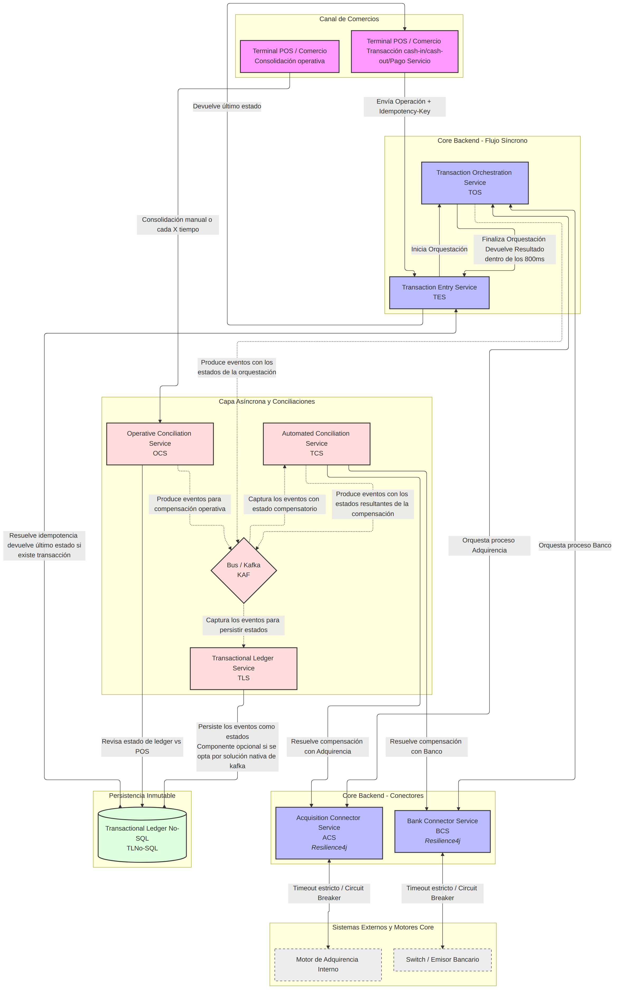
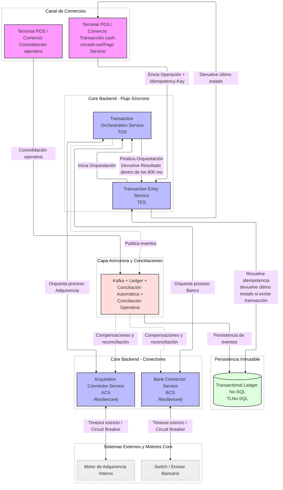
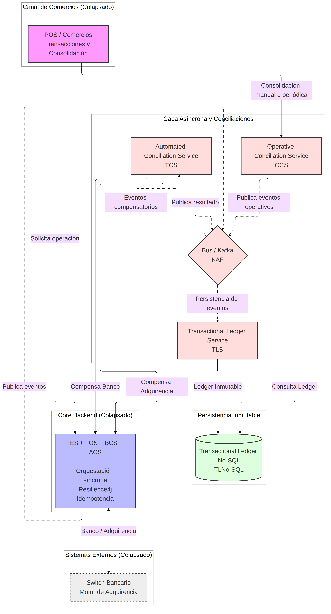

# Presentación

Este caso de negocio busca proponer el diseño de una corresponsalía financiera, entendiendo que las operaciones que hace es cash-in (Depositar dinero en el banco del cliente), cash-out (Retirar dinero del banco del cliente) y pago de servicios (Depositar dinero en la cuenta de un tercero). La parte de corresponsalía nos da un hint sobre un intermediario de operaciones, para términos prácticos asumamos que es el POS (Point of Sale).

Proponer el diseño implica definir la arquitectura target, anticipar riesgos y habilitar a múltiples squads para ejecutar con excelencia operativa.

La manera en que se abordará el siguiente caso de negocios será analizando:

1. El problema. 
2. Las restricciones.
3. Los trade-offs por primera vez a manera de lluvia de ideas.
4. La arquitectura propuesta.
5. Los trade-offs una segunda vez a manera de conclusión ya una vez expuesta la arquitectura.

> Cabe señalar que en el transcurso del caso agregaré una sección como esta para notas.

# El problema

Se menciona que el sistema actual (SA) tiene los siguientes problemas:

**Problema 1**: Fallas parciales en la red en la "última milla" del comercio. Esto significa a grandes rasgos divergencia de estados:
1. Saldos duplicados.
2. Dinero retenido sin reflejo en la caja física.

**Problema 2**: Evolucionar el SA que es una integración síncrona/monolítica hacia una arquitectura distribuida (resiliente e inmune a las conexiones inestables).

> Resiliente nos da el hint de que debe tomar en cuenta fallos o timeouts con lo que sea que integre nuestro SA. Al ser corresponsalía claramente es con APIs de terceros, básicamente el banco y emisoras autorizadoras por aquello de usar visa, mastercard o amex. Inmune a conexiones inestables nos dice que lo síncrono no es lo óptimo así que posiblemente hay que pensar en asincronicidad.

Vale la pena aquí aterrizar visualmente los problemas:

_El cajero ansioso_: Saldos duplicados implica que hago una transacción (tx-001) y esta por fallas parciales en la red se ejecutó varias veces hasta que la transacción devolvió un estado exitoso para nuestro cajero ansioso, sin embargo se intuye que el SA ejecutó la transacción sin ningún atisbo de idempotencia. Por tanto en el balance se verá el monto del cash-in duplicado.

> Idempotencia se entenderá como ejecutar la misma transacción una o varias veces y el resultado final deberá ser el mismo: un solo cargo o un solo retiro.

_El cajero fantasma_: Dinero retenido sin reflejo en caja física implica que se hace una transacción (tx-001) pero nuestro cajero nunca recibió notificación alguna. Puede ser que no había red cuando se recibe la confirmación. 

# Las restricciones

Qué sería de un mundo sin restricciones y los sistemas no se escapan, básicamente tenemos las siguientes restricciones:

1. Escala: 
 1.1 +15 millones de usuarios 
 1.2 +12,000 transacciónes concurrentes (TPS) en hora pico
2. SLA Backend: 
 2.1 Tiempo de respuesta máximo de 800ms
 2.2 Uptime global objetivo 99.95%
3. Última Milla: 15% de las tiendas operan con conectividad intermitente: alta latencia y pérdida de paquetes.
4. Componentes core:
 4.1 Terminal física (POS)
 4.2 Motor de adquirencia interno
 4.3 Ledger/Core Bancario (Saldos en tiempo real)

> Con estas restricciones del punto 1 y 2 los componentes o servicios que pensemos deben ser fácilmente escalables para hora pico y el SLA de cada uno incluyendo escenarios de timeout sumados deben dar cuando mucho 800ms
> Las tiendas deben tener manera de consultar la transacción, creo yo que la idempotencia debe incluir el estado como respuesta.

# Revisando los trade-offs

En el caso de negocio a resolver se proveen una serie de trade-offs, sería una pena no revisarlos primero antes de proponer cualquier diseño o arquitectura para entender los hints y las restricciones que nos dan.

## A. Integridad Transaccional y Persistencia.

### **A.1 Orquestación**: Estrategia arquitectónica para garantizar consistencia estricta de saldos entre la tienda y el Core Bancario.

Visualizando la consistencia estricta:

Un cash-out exitoso

| Transacción | Entidad               | Cuenta             | Débito | Crédito |
| ----------- | --------------------- | ------------------ | -----: | ------: |
| tx-001      | Tienda (Corresponsal) | Caja física        |        |     500 |
| tx-001      | Core Bancario         | Cuenta del cliente |    500 |         |

Un cash-in exitoso

| Transacción | Entidad               | Cuenta             | Débito | Crédito |
| ----------- | --------------------- | ------------------ | -----: | ------: |
| tx-001      | Tienda (Corresponsal) | Caja física        |    500 |         |
| tx-001      | Core Bancario         | Cuenta del cliente |        |     500 |

Un cash-in duplicado (cajero ansioso)

| Transacción | Entidad               | Cuenta             | Débito | Crédito |
| ----------- | --------------------- | ------------------ | -----: | ------: |
| tx-001      | Tienda (Corresponsal) | Caja física        |    500 |         |
| tx-001      | Core Bancario         | Cuenta del cliente |        |     500 |
| tx-001      | Core Bancario         | Cuenta del cliente |        |     500 |

Un cash-in retenido (cajero fantasma)

| Transacción | Entidad               | Cuenta             | Débito | Crédito |
| ----------- | --------------------- | ------------------ | -----: | ------: |
| tx-001      | Tienda (Corresponsal) | Caja física        |    500 |         |

> Justo esto tipo de escenarios tenemos que evitar.

Hasta este punto nuestra estrategia debe incluir alguna manera de saber en qué estado se encuentra la transacción para garantizar consistencia estricta entre la tienda y el banco. Esto lo lograremos categorizando nuestro flujo.

1. NEW_CASHIN --> Cuando inicia transacción.
2. BANK_CREDIT_IN_PROCESS --> Contactando emisor bancario para hacer crédito.
3. BANK_CREDIT_DONE --> Crédito aplicado.
4. COMPLETE_CASHIN --> POS recibe el estado, el cajero acepta el dinero (Débito aplicado).

Esta categorización nos dará siempre el estado en que se encuentra la transacción independientemente de si nos vamos por una SAGA orquestada o una SAGA coreografiada o una mezcla de ambas como veremos más adelante.

### **A.2 Idempotencia**: Diseño técnico para neutralizar reintentos duplicados provenientes de terminales con alta latencia.

Los estados solo nos dicen en qué va nuestra transacción sin embargo para evitar duplicados necesitamos asumir algún elemento de nuestra transacción como la **idempotency-key**. Es decir el identificador con el cual podamos recuperar en qué estado va nuestra transacción y evitar duplicados o si no existe iniciar la transacción. 

> En este punto suena a que necesitaremos un servicio de entrada "un servicio tipo gateway" cuya labor sea como la de un guardian: ¿Ya estás registrado? Sí, no pasas, no, regístrese aquí y pase.

### **A.3 Estrategia de datos**: Elección y justificación del paradigma de base de datos idóneo para el Ledger transacciónal bajo alta concurrencia.

Aquí tenemos varios puntos que pensar:

1. Alta concurrencia implica que debemos evitar operaciones tipo update.
2. Al mencionar "ledger transacciónal" nos da el hint de que posiblemente solo estemos haciendo "append" o "insert" de las transacciónes y sus diferentes estados.
3. Ya contamos con la idempotency-key como llave para obtener los registros e incluso si vamos guardando por fecha-hora de procesamiento podemos recuperar el último estado.
4. Una base de datos no-sql nos garantiza alta concurrencia, pero sacrificando consistencia (Vale la pena recordar el teorema CAP).
5. Una base de datos sql nos garantiza consistencia, pero el coste de escalabilidad puede ser alto o ser superado por la alta concurrencia.

Hasta aquí pensando en la naturaleza de lo que vamos a almacenar parece que el candidato ideal es no-sql, pero teniendo en cuenta:

1. Control de Concurrencia Optimista, básicamente si NEW_CASHIN en secuencia es menor que BANK_CREDIT_IN_PROCESS el sistema no permitirá insertar este último en caso de colisión.
2. Procesamiento secuencial mediante colas, básicamente no habrá un API que escriba a la base de datos, sino que se usará Apache Kafka o AWS Kinesis.

Pensando en nuestro flujo de estados de un cashin ideal con estas ideas:

| Transaction ID / Idempotency Key (PK) | Sequence (SK) | Status / Event | Amount | Details |
| :--- | :--- | :--- | :--- | :--- |
| tx_cashin_55002 | 1 | NEW_CASHIN | 500.00 | Inicio de solicitud de depósito de efectivo en corresponsal. |
| tx_cashin_55002 | 2 | BANK_CREDIT_IN_PROCESS | 0.00 | Enviando comando de abono al switch bancario. |
| tx_cashin_55002 | 3 | BANK_CREDIT_DONE | 500.00 | Crédito bancario confirmado por emisor. ID rastreo: bnk_9988. |
| tx_cashin_55002 | 4 | COMPLETE_CASHIN | 500.00 | Cash-in completado con éxito. Saldo disponible para usuario. |
| tx_cashin_55002 | 5 | COMPLETE_CASHIN | 500.00 | Efectivo recibido en caja física por operador POS_88. |


## B. Resiliencia en Ambientes Degradados

### **B.1 Aislamiento**: Mecanismos para proteger el backend contra la saturación de recursos cuando fallen los actores externos.

Hasta este punto intuyo que el monolito de manera síncrona consume las APIs externas del core bancario para prevalidaciones, reservas de monto y finalmente aplicar monto, también asumo que lo hace para el motor de adquirencia interno. Pero que pasa si estos componentes externos no responden o no sirven o tardan en responder. Es ahí donde tenemos que pensar en herramientas que nos resuelvan el problema.

Para una arquitectura distribuida tenemos que crear un componente connector que sirva como puente o wrapper del componente externo que no controlamos. El componente connector tiene que manejar los timeouts así como la sobrecarga de peticiones si el componente externo está caído o con fallos. Esto en mi experiencia se puede resolver usando resilience4j el cual nos permite configurar:

1. Timeouts Estrictos(El límite de tiempo), tal cual definir connection timeout y read timeout
2. Circuit Breaker(El fusible), el cual dependiendo del estado del componente externo nos da los fabulosos estados CLOSED, HALF-OPEN u OPEN. Basta recordar que si las llamadas superan cierto umbral de error el circuito pasará de CLOSED a OPEN. Donde OPEN bloqueara cualquier llamada al externo, manteniendo estabilidad en nuestro backend.
3. Bulkhead(Aislamiento de recursos), se le asignan un número máximo de hilos concurrentes al connector. 

### **B.2 Timeouts y compensaciones**: Definición lógica de las ventanas de tiempo y el diseño de reversiones automáticas asíncronas.

Hasta aquí hemos hablado de la factibilidad de timeouts mediante el uso de resilience4j, pero no de las ventanas de tiempo. En la revisitada presentaremos las ventanas de tiempo para cada componente de la arquitectura propuesta. Obviamente la suma de máximos de tiempos de respuesta individuales no deben exceder el compromiso máximo del sistema, que es de 800 ms.

Respecto al diseño de reversiones automáticas asíncronas básicamente de manera síncrona devolvemos al POS que no hubo éxito y de manera asíncrona procedemos a verificar y revertir en caso de que por satisfacer el timeout u otro resultado el banco no nos respondió a tiempo. 

Una tabla con el flujo puede anticipar la idea:

| Transaction ID / Idempotency Key (PK) | (SK) | Status / Event | Amount | Details |
| :--- | :--- | :--- | :--- | :--- |
| tx_cashin_55002 | 1 | NEW_CASHIN | 500.00 | Inicio de solicitud de depósito. |
| tx_cashin_55002 | 2 | BANK_CREDIT_IN_PROCESS | 0.00 | Contactando switch bancario. |
| tx_cashin_55002 | 3 | BANK_CREDIT_TIMEOUT | 0.00 | [SÍNCRONO] Excedido límite de 600ms. |
| tx_cashin_55002 | 4 | BANK_CREDIT_REVERSAL_REQ | 0.00 | [ASÍNCRONO] El banco sí la tenía. Se pide reversa. |
| tx_cashin_55002 | 5 | CASHIN_REVERTED | 500.00 | [ASÍNCRONO] Reversa exitosa. Transacción cerrada sin pérdidas. |


## C. Observabilidad y Saneamiento Financiero

### **C.1 Trazabilidad Híbrida**: Estrategia de monitoreo para rastrear y auditar una transacción de extremo a extremo.

Suena tentador usar **Idempotency-key** totalmente o en parte para un header que sustente x-correlationId este header debe ser captado por todos los componentes y añadidos vía log al hacer operaciones, estas operaciones pueden pensarse como TASK y granularizar SUBTASK. Si los vamos a añadir como un log vale la pena definir una wrapper a ese log y que sea parte de una librería que los componentes usen para hacer log incluyendo el x-correlation-id posteriormente con dynatrace u otra herramienta similar obtenemos trazabilidad de extremo a extremo.

Un ejemplo de log:

```json 
{
  "timestamp": "2026-06-26T19:10:02.123Z",
  "level": "INFO",
  "service": "cashin-connector-service",
  "x_correlation_id": "tx_cashin_55002",
  "task": "CASHIN_ORCHESTRATION",
  "subtask": "BANK_CREDIT_DISPATCH",
  "execution_time_ms": 450,
  "resilience": {
    "circuit_breaker_state": "CLOSED",
    "bulkhead_available_permission": 18
  },
  "message": "Petición enviada con éxito al switch bancario emisor."
}
```
Aterrizando la solución a AWS: Amazon CloudWatch Logs + Embedded Metric Format (EMF) o de manera nativa AWS X-Ray (Dynatrace).


### **C.2 Conciliación Automatizada:** Modelo técnico para identificar y corregir discrepancias financieras causadas por cortes de energía o red de comercios.

Con lo que hemos tratado en los puntos anteriores idempotencia resuelve en cierta forma el cajero ansioso y el cajero fantasma. Sin embargo puede que por un corte de energía no sepamos si la petición se envió por un lado y por otro lado tampoco sabemos si efectivamente se entregó o se recibió el dinero por error humano en el caso de un cajero. Por lo que se intuye será necesario un proceso que cada cierto tiempo concilie el estado de las transacciónes en el POS versus el estado actual de dichas transacciónes. En caso de discrepancia se procederá mediante un enfoque asíncrono de eventos a compensar la transacción. Esto sin duda es un riesgo que con la estrategia se minimizará, pero está latente en particular en esas tiendas susceptibles a fallas de energía o red. 

## D. Gestión de Crisis y Modelo de ingeniería

### D.1 **Simulacro bajo Fuego**: Definir el plan de acción del personal (Minutos 5, 15 y 30) ante una ráfaga de retiros duplicados que sature las colas de procesamiento en hora pico y comprometa el balance financiero.

En arquitecturas distribuidas es necesario contar con los "ojos" que nos permitan ver que está haciendo nuestro sistema. Como se mencionó antes la trazabilidad nos da la visión de extremo a extremo, pero no es suficiente la misma trazabilidad se tiene que analizar y enriquecer para generar métricas tales como el número de peticiones, número de fallos o excepciones, etcétera. Además, dependiendo de nuestro proveedor de nube las métricas de los componentes, muchos proveedores incluso nos permiten crear alertas ante comportamientos inusuales o aumento de errores, por lo que el plan del personal deberá estar apoyado en esas medidas.

### D.2 **Gobernanza de Contratos**: Estrategia de diseño de interfaces para permitir que múltiples squads construyan piezas del sistema en paralelo sin generar dependencias cruzadas.

En este punto si optamos por ejemplo por el uso de eventos se puede hacer uso de schema registry, también la estandarización de las APIs devengadas en componentes se puede hacer uso de OpenApi. Sin embargo esto no será suficiente si no se cuenta con un lugar centralizado donde estén versionados estos "contratos" y que sean el único referente. También vale asignar squads por componente y que cada squad maneje el "ownership". Estas ideas se profundizarán más adelante.

--------------------------------

Hasta este punto la idea como se mencionó en la presentación era entender o dar una primera visita a los trade-offs que en cierta forma funcionan como las restricciones o guías adicionales para nuestro diseño técnico y por ende para la arquitectura.

# Arquitectura distribuida propuesta

## Justificacion de arquitectura distribuida

El pilar de esta arquitectura distribuida consiste en descomponer las funcionalidades del sistema en dominios de negocio independientes (basados en _Bounded Contexts_), donde cada uno opera como un componente desacoplado con finalidades operativas específicas:

1. **Escalabilidad Elástica e Independiente**: Cada dominio se escala horizontalmente según sus necesidades intrínsecas de carga. No todos los componentes experimentan el mismo tráfico; el dominio de transacciónes de alta concurrencia requerirá más recursos que el de reportería. Un enfoque monolítico nos obligaría a escalar toda la aplicación de forma unificada e ineficiente. Al distribuirlos, optimizamos el uso de infraestructura escalando únicamente el servicio que lo requiere.

2. **Aislamiento de Cambios y Reducción del Radio de Impacto**: Al delimitar las responsabilidades, cualquier modificación o evolución en la funcionalidad del Dominio A se realiza de manera aislada, sin necesidad de alterar o poner en riesgo la estabilidad del Dominio B (salvo, estrictamente, cuando el cambio afecte el contrato de integración entre ambos).

3. **Alineación de Equipos y Ownership Claro**: La distribución por dominios facilita la organización del trabajo mediante Squads autónomos. Es posible asignar un equipo de ingeniería enfocado exclusivamente en la evolución del Dominio A y otro al Dominio B. Esto elimina la fricción en el código, reduce la carga cognitiva de los desarrolladores y define un ownership absoluto sobre cada componente del sistema.


## Justificación del uso de SAGA Orquestación

Ahora que nuestro sistema va a lidiar con su funcionalidad distribuida en distintos servicios, tenemos que definir cómo vamos a asegurar la consistencia. Para esto, evaluamos los dos enfoques de SAGA:

- Coreografía
  - Este sería el enfoque inmediato, ya que los estados de nuestro sistema se resolverían como eventos producidos y la consistencia eventual estaría garantizada por diseño.
  - Sin embargo, tenemos una restricción clara: el POS está haciendo una transacción en tiempo real y el cajero espera saber el resultado de inmediato para recibir o no el dinero. Además, el análisis de datos nos muestra que solo el 15% de las tiendas opera con conectividad intermitente; el 85% restante funciona bien de manera síncrona. Movernos a un modelo 100% asíncrono e impulsado por eventos no es necesariamente la mejor solución para la realidad de nuestro negocio.
- Orquestación
  - Este enfoque se ajusta cuando hay un conocimiento estricto del orden o una sincronía resolutiva, el cual es exactamente nuestro caso. Nosotros gobernamos un ciclo de vida cerrado con cuatro estados definidos:
    - NEW_CASHIN (Cuando inicia la transacción).
    - BANK_CREDIT_IN_PROCESS (Contactando al emisor bancario para hacer el crédito).
    - BANK_CREDIT_DONE (Crédito aplicado por el banco).
    - COMPLETE_CASHIN (El POS recibe el estado y el cajero acepta el dinero, aplicando el Débito).
  - Sin embargo, necesitamos inmunidad ante las conexiones inestables. Si nos quedamos en una orquestación tradicional donde la compensación (la reversa) se ejecuta de forma síncrona en el mismo hilo, la intermitencia de la red va a colgar el backend y va a destrozar el compromiso de SLA de 800ms hacia el POS.

La Propuesta: **Orquestación con Compensación Asíncrona**

Esta reflexión nos lleva a plantear una solución híbrida. Vamos a usar Orquestación para el camino feliz, garantizando que el 85% de las tiendas estables fluyan de forma síncrona y rápida a través de los cuatro estados.
Pero para la parte de las fallas —entendiendo que en SAGA la parte compensativa es fundamental— desacoplaremos la ejecución. Si el conector con el banco da un timeout en el paso 2, el orquestador síncrono corta la petición, le devuelve al POS un estado de contingencia y registra el fallo.
A partir de ahí, la SAGA se vuelve asíncrona: un evento en nuestro ledger disparará un worker en segundo plano que se encargará de verificar el estado real en el emisor bancario y ejecutar el revert de forma agnóstica al POS. Logramos lo mejor de los dos mundos: control total del flujo síncrono y resiliencia asíncrona ante la intermitencia.

## Diagrama de la arquitectura propuesta

### Diagrama con la arquitectura completa

El siguiente diagrama proporciona una perspectiva holística de la plataforma transaccional distribuida. Ilustra la interacción de punta a punta, desde el ingreso del estímulo en el canal físico (Terminal POS), pasando por las capas síncronas de orquestación y conectores blindados en el Core Backend, hasta el desacoplamiento de la persistencia atómica y los motores de conciliación asíncrona.



### Diagrama con énfasis en componentes orquestadores

La siguiente figura muestra de manera aislada los componentes críticos que gobiernan la ventana de tiempo síncrona. Se detalla el comportamiento del Transaction Entry Service (TES) y el Transaction Orchestration Service (TOS), enfatizando el blindaje perimetral implementado mediante Resilience4j (Circuit Breaker y Time Limiter) en los servicios conectores (BCS y ACS) para salvaguardar el SLA de 800 ms frente a la latencia de switches externos.



### Diagrama con énfasis en componentes compensatorios

La siguiente vista describe el ecosistema desacoplado encargado de absorber eventos y gestionar la consistencia eventual. Se detalla el flujo de mensajes a través del bus de eventos de alta concurrencia hacia el Transactional Ledger Service (TLS) y los motores de conciliación automatizada (TRS y ORS), responsables de ejecutar las Sagas de compensación y neutralizar los descuadres financieros sin impactar la experiencia del usuario en la terminal.



## Tabla de los componentes

Los componentes a alto nivel:

| Componente | Capa / Tipo | Responsabilidad Principal | Riesgo Crítico | Mitigación Arquitectónica |
| :--- | :--- | :--- | :--- | :--- |
| **TES** *(Transaction Entry Service)* | Síncrona / API Gateway | Validar la petición inicial del POS y resolver la idempotencia de forma síncrona. | Cuello de botella en lecturas/escrituras rápidas bajo 12,000 TPS. | Conexión directa a Base NoSQL con lectura indexada por Clave de Partición ($O(1)$). |
| **TOS** *(Transaction Orchestration Service)* | Síncrona / Core | Coordinar operaciones y gestionar la transición de estados. | Bloqueo de hilos y degradación del SLA de 800ms por lentitud de terceros. | Corte síncrono inmediato ante fallas y delegación de los estados y las compensaciones por ende a Kafka. |
| **BCS** *(Bank Connector Service)* | Síncrona (Asíncrona) / Conector | Aislar la comunicación técnica con el switch o emisor bancario. | Saturación de recursos del backend si el banco externo se cae o ralentiza. | Implementación estricta de *Timeouts*, *Circuit Breaker* y *Bulkhead* vía **Resilience4j**. |
| **ACS** *(Acquisition Connector Service)* | Síncrona (Asíncrona) / Conector | Gestionar la interacción con el motor de adquirencia interno. | Saturación de recursos del backend si el el motor de adquirencia se cae o ralentiza. | Implementación estricta de *Timeouts*, *Circuit Breaker* y *Bulkhead* vía **Resilience4j**. |
| **KAF** *(Bus / Kafka)* | Asíncrona / Eventos | Transportar los eventos de estados de forma desacoplada y por ende las compensaciones. | *Lag* en las colas debido a ráfagas masivas de transacciónes duplicadas. | Particionado por *Idempotency-Key* para garantizar procesamiento secuencial paralelo e implementación de un patrón Dead Letter Queue (DLQ) para aislamiento inmediato de payloads corruptos. |
| **TLS** *(Transactional Ledger Service)* | Asíncrona / Worker | Consumir eventos de Kafka y persistir el historial detallado de auditoría. | Pérdida de orden cronológico en la inserción de estados financieros. | Uso de la clave de ordenación (`Sequence`) y validación de expresiones condicionales. |
| **TCS** *(Automated Conciliation Service)* | Asíncrona / Worker | Resolver de forma asíncrona los *timeouts* ejecutando consultas y reversas al banco o a la adquirencia. | Ejecución de una reversa errónea si el estado del banco (adquirencia) se lee de forma incorrecta. | Reintentos exponenciales con validación estricta usando la `Idempotency-Key` original. |
| **OCS** *(Operative Conciliation Service)* | Asíncrona / Worker | Identificar y corregir discrepancias por fallas de energía o errores del cajero. | Descuadre financiero prolongado si el POS no reporta sus datos locales. | Mecanismo de *Journaling* local en el POS con sincronización forzada al recuperar red. |
| **TLNoSQL** *(Transactional Ledger No-SQL)* | Persistencia | Almacenar el historial inmutable de transacciónes como fuente de verdad. | Latencia elevada si el volumen de registros históricos crece exponencialmente. | Diseño de tabla inmutable (*Append-only*). |

## Explicación Detallada de los Componentes

### 1. Capa Síncrona y Core (Control del SLA de 800ms)

- **TES (Transaction Entry Service)**: Funciona como la aduana del sistema. Su única tarea es recibir la petición del POS e interceptar reintentos, verificar si la Idempotency-Key ya existe en la base de datos y, si es un reintento, regresar el último estado sin estresar al resto del backend. Para garantizar la escala de 12,000 TPS sin degradar el Ledger NoSQL, el TES se apoyará en una capa de caché distribuida de ultra-baja latencia (ej. Amazon ElastiCache para Redis) con un TTL corto de 15 minutos, sirviendo como primer filtro atómico de llaves de idempotencia. Si la llave es nueva, se registra y se hereda la validación al Ledger NoSQL (TLNoSQL) mediante Lecturas Consistentes Fuertes (Strongly Consistent Reads). Esto elimina cualquier riesgo de inconsistencia eventual en ráfagas rápidas de transacciones consecutivas de un mismo usuario.

- **TOS (Transaction Orchestration Service)**: Es el director de orquesta. Conoce el orden secuencial de los estados (NEW_CASHIN, BANK_CREDIT_IN_PROCESS). Si los conectores involucrados tardan más de lo estipulado, el TOS aborta el hilo síncrono de inmediato para salvar el SLA. El TOS para cada estado generará el evento pertinente incluyendo los eventos compensatorios por timeout o falla.

### 2. Capa de Conectores (Protección contra Terceros)

- **BCS y ACS (Bank & Acquisition Connector Services):** Son los amortiguadores de la arquitectura. Traducen los datos y aíslan los sistemas externos. Al usar Resilience4j, si el emisor externo empieza a fallar, el Circuit Breaker se abre, impidiendo que las peticiones sigan viajando a la red y tumbando el backend por acumulación de hilos en espera.

### 3. Capa Asíncrona (Resiliencia e Inmunidad a Fallas de Red)

- **KAF (Bus / Kafka):** El sistema circulatorio de eventos. Recibe las notificaciones de los estados e intermitencias técnicas. Al estar particionado por el ID de la transacción, asegura que los eventos de una misma operación se procesen estrictamente en el orden en que ocurrieron. Para evitar cortes en el pipeline por fallos de deserialización o payloads corruptos (Poison Pills), los workers implementarán una cola de reintentos finitos y derivación automática a una Dead Letter Queue (DLQ), aislando el mensaje defectuoso y disparando alertas críticas al equipo de SRE sin detener el flujo general.

- **TLS (Transactional Ledger Service):** Un worker especializado en auditar los diversos estados en los que incurre una transacción desde su inicio hasta que se completa. Escucha lo que pasa en el bus y lo escribe en el Ledger inmutable (NoSQL). Actúa tras bambalinas para que el flujo síncrono no tenga que esperar por escrituras pesadas de logs históricos. Dependiendo de la implementación incluso se puede eliminar.

- **TCS (Transactional Automated Conciliation Service):** El rescatista técnico. Cuando ocurre un BANK_CREDIT_TIMEOUT, este componente despierta de forma asíncrona, va con el banco, pregunta el estado real de la Idempotency-Key y, si el banco sí aplicó el cobro, ejecuta la reversa automáticamente para que los balances queden en cero. Algo clave para la consistencia estricta de saldos entre la tienda y el core Bancario.

- **OCS (Operative Conciliation Service):** El auditor del mundo físico. Resuelve los impactos de los cortes de energía en las tiendas. Compara los datos guardados en la memoria local del POS contra el Ledger del backend para detectar si el cajero entregó o recibió el efectivo de forma correcta.

### 4. Capa de Persistencia Inmutable

- TLNoSQL (Transactional Ledger No-SQL): El libro contable inmutable. Implementado sobre tecnología como Amazon DynamoDB, guarda cada cambio de estado como un registro nuevo (Sequence 1, 2, 3...). Al prohibir los UPDATES, elimina por completo los bloqueos de base de datos bajo alta concurrencia, permitiendo soportar los 12,000 TPS sin degradación.

### Tabla con la implementación de los componentes dentro de AWS

En el caso de negocio se menciona que el backend está en AWS, entonces a continuación se muestra una tabla de los componentes con su respectiva implementación en AWS.

| Componente | Capa / Tipo | Servicio AWS Sugerido | Rol Técnico en AWS | Justificación / Ventaja en Alta Concurrencia |
| :--- | :--- | :--- | :--- | :--- |
| **TES** *(Transaction Entry)* | Síncrona / API Gateway | **AWS ECS (Fargate) + Amazon API Gateway** | API Gateway gestiona la entrada, y ECS Fargate corre el microservicio contenedorizado. | API Gateway aplica *throttling* y validación de headers (`X-Correlation-ID`) en la frontera. ECS escala horizontalmente en segundos según el uso de CPU. |
| **Idempotency Cache** | Síncrona / Frontera | **Amazon ElastiCache (Redis OSS Cluster)** | Cache de paso rápido en memoria para llaves de idempotencia activas. | Mitiga el cuello de botella en lecturas rápidas sobre DynamoDB. Ofrece respuestas sub-milisegundas ($<2\text{ms}$) para interceptar reintentos duplicados del POS en la frontera de red. |
| **TOS** *(Orchestration)* | Síncrona / Core | **AWS ECS (Fargate)** | Microservicio en contenedor que ejecuta la lógica de la SAGA síncrona. | Cómputo *serverless* para contenedores. No administras servidores y garantiza baja latencia al estar en la misma VPC que la base de datos. |
| **TOS** *(Orchestration)* | Síncrona / Core | **AWS Step Functions (Express Workflows)** | Orquestador nativo serverless que ejecuta la SAGA de manera síncrona (`StartSyncExecution`). | Soporta más de 100,000 TPS. Elimina la complejidad de programar la lógica del flujo y reintenta/deriva a estados de contingencia de forma nativa ante fallas de conectores sin degradar el SLA. |
| **BCS** *(Bank Connector)* | Síncrona / Conector | **AWS ECS (Fargate)** o **AWS Lambda** | Contenedor o función que aloja el cliente HTTP hacia el banco, protegido con **Resilience4j**. | Permite configurar límites de conexiones salientes por VPC y aislar por completo las llaves criptográficas del banco mediante *AWS Secrets Manager*. |
| **ACS** *(Acquisition Connector)*| Síncrona / Conector | **AWS ECS (Fargate)** | Contenedor dedicado a la integración con el motor de adquirencia interno. | Al estar separado de BCS, la caída del switch bancario externo no arrastra ni bloquea las llamadas hacia la adquirencia interna. |
| **KAF** *(Bus / Events)* | Asíncrona / Eventos | **Amazon MSK (Managed Streaming for Apache Kafka)** | Clúster de Kafka completamente administrado por AWS. | Soporta millones de mensajes por segundo con persistencia en disco. Al usar el `Idempotency-Key` como *Partition Key*, garantiza orden secuencial estricto. |
| **TLS** *(Ledger Service)* | Asíncrona / Worker | **AWS ECS (Fargate)** o **AWS Lambda** | Consumidor asíncrono (Consumer Group) de los eventos de Kafka. | Escala de manera independiente el número de instancias/hilos para vaciar las colas de Kafka velozmente sin afectar al flujo síncrono del POS. |
| **TCS** *(Automated Conciliation)*| Asíncrona / Worker | **AWS Step Functions + AWS Lambda** | Orquestador de flujos visuales que ejecuta funciones Lambda para las reversas asíncronas. | Step Functions maneja de forma nativa los reintentos exponenciales (*backoff*) y captura de errores si el banco tarda horas en responder la reversa. |
| **OCS** *(Operative Conciliation)*| Asíncrona / Worker | **AWS Batch** o **Amazon EMR** | Procesamiento por lotes (Batch) programado cronológicamente (ej. cada hora o Fin de Día). | Ideal para ejecutar algoritmos pesados de reconciliación y cruce de archivos (Arqueo físico vs Ledger NoSQL) sin consumir recursos transaccionales. |
| **TLNoSQL** *(Ledger Storage)* | Persistencia | **Amazon DynamoDB** | Base de datos NoSQL clave-valor clave de ultra alta velocidad. | Soportará los 12,000 TPS con latencia menor a 10ms utilizando el modelo inmutable (*Append-only*), usando Expresiones Condicionales para evitar colisiones. |
| **Monitoreo** *(Observabilidad)* | Transversal | **Amazon CloudWatch (Logs/EMF) + AWS X-Ray** | Almacenamiento de logs estructurados en JSON y mapa de rastreo distribuido (*Distributed Tracing*). | CloudWatch Logs Insights permite buscar una `Idempotency-Key` entre terabytes de logs en segundos. X-Ray visualiza los cuellos de botella del SLA de 800ms. |


# Contrastando la arquitectura propuesta versus los trade-offs

## 1. Integridad Transaccional y Persistencia.

### **1.1 Orquestación**: Estrategia arquitectónica para garantizar consistencia estricta de saldos entre la tienda y el Core Bancario.

**Conclusión**

La estrategia arquitectónica que garantiza la consistencia estricta es el patrón de **Orquestación con Compensación Asíncrona** por encima de la coreografía típica que se adopta al migrar a arquitecturas distribuidas. Como se discutió previamente, el 85% de las tiendas ha funcionado correctamente con la Orquestación síncrona; es por ello que el patrón de Orquestación distribuida es una evolución natural. Sin embargo, al tener la restricción del SLA de 800ms, se opta por desacoplar el manejo de estados intermedios y las compensaciones derivadas hacia una ejecución asíncrona.

Para que esta orquestación (soportada de forma nativa e inmune a servidores mediante **AWS Step Functions Express** o **AWS ECS**) garantice una consistencia estricta de saldos entre la tienda y el Core Bancario, se establecen las siguientes premisas operativas:

* **Control de Estados Imperativos (La regla de oro):** El orquestador es el único componente con la autoridad para validar si la transacción alcanzó con éxito los estados deterministas (`BANK_CREDIT_DONE` para Cash-In o `BANK_DEBIT_DONE` para Cash-Out). No se delega esta responsabilidad a eventos intermedios.
* **Blindaje del Efectivo en Caja:** Si y solo si el orquestador confirma y firma que el estado bancario es exitoso, se le otorga luz verde síncrona al POS a través del `TES` para que el cajero físicamente acepte el dinero (Cash-In) o entregue el efectivo (Cash-Out). Si el sistema entra en un estado de incertidumbre (como un *Timeout* de 600ms gestionado por *Resilience4j*), el orquestador frena en seco el flujo síncrono y responde el estado `CASHIN_IN_COMPENSATION`, bloqueando operativamente la caja física mientras la compensación se ejecuta en el fondo.
* **Resolución de Disputas en Capa Asíncrona:** Al centralizar la máquina de estados, si el canal síncrono se corta por un parpadeo de red en la última milla, no se dejan cabos sueltos. El orquestador delega la reversa o la confirmación a la capa asíncrona (Kafka + Workers de Conciliación), asegurando que el backend barra, concilie y limpie los balances de las cuentas puente de forma transparente y automatizada.


### **1.2 Idempotencia**: Diseño técnico para neutralizar reintentos duplicados provenientes de terminales con alta latencia.

**Conclusión**

La estrategia de inyectar una **Idempotency Key universal** (proveniente desde el atributo `traceability` de la NetPay Smart API) directamente en la capa de admisión (`TES`) es la única manera de blindar el sistema contra la latencia de la última milla. En un ecosistema distribuido a 12,000 TPS, no podemos permitir que un parpadeo de red o un operador desesperado duplique transacciónes financieras en el Core Bancario.

> La elección de `traceability` se basa en la documentación oficial de NetPay Smart API, donde se define como un identificador proporcionado por el comercio para correlacionar sus transacciónes.

Para que este diseño funcione con consistencia estricta, se establecen las siguientes premisas operativas:

* **Aduana de Admisión en el `TES`:** El `Transaction Entry Service` funciona como la frontera síncrona exclusiva. Ante un reintento del POS, el `TES` intercepta la llave mediante una consulta indexada de alta velocidad ($O(1)$) en el Ledger No-SQL. Si la operación ya existe o está en proceso, frena el flujo de inmediato y devuelve el último estado conocido, impidiendo que el orquestador (`TOS`) vuelva a disparar la Saga.
* **Bloqueo Atómico anti-Carreras:** La última línea de defensa es la restricción de unicidad de la llave compuesta (PK: Idempotency Key, SK: Sequence) en DynamoDB. Si dos peticiones idénticas golpean el backend exactamente al mismo milisegundo debido a un defecto de red o del dispositivo, las expresiones condicionales de la base de datos abortarán el segundo *insert* de forma atómica, pulverizando cualquier riesgo de saldos duplicados.
* **Determinismo en Redes Degradadas:** Si la red se cae justo cuando el backend intenta responderle al comercio, los reintentos automáticos de la terminal física recibirán siempre la misma respuesta exacta guardada en el Ledger. El sistema jamás dejará un flujo huérfano ni duplicará cargos por fallas de comunicación en el reintento.
* **Resiliencia Perimetral en el Dispositivo (Mecanismo POS):** Para mitigar el escenario donde la red de la última milla muere antes de que el backend responda el estado de contingencia a la terminal, el software del POS implementará un protocolo de Bloqueo de Interfaz. Si la terminal pierde conexión tras enviar una petición, la pantalla operativa se congelará impidiendo que el cajero cancele o duplique la acción de forma manual. Al recuperar enlace, el dispositivo invocará obligatoriamente un endpoint de consulta en el TES con la Idempotency-Key original para conocer el veredicto real del backend antes de permitirle al operador recibir o entregar efectivo físicamente.


### **1.3 Estrategia de datos**: Elección y justificación del paradigma de base de datos idóneo para el Ledger transacciónal bajo alta concurrencia.

**Conclusión**

La estrategia de datos óptima para el Ledger transacciónal bajo alta concurrencia es un **modelo append-only sobre una base de datos NoSQL**, estructurado mediante un diseño de tabla inmutable que prohíbe por completo el uso de operaciones tipo `UPDATE`. Al tratar cada cambio de estado del workflow como un insert secuencial nuevo, eliminamos los bloqueos de registros y la contención en la base de datos que harían colapsar a un motor relacional tradicional a 12,000 TPS.

Para garantizar que este paradigma NoSQL mantenga una integridad contable impecable, se establecen las siguientes directrices arquitectónicas:

* **Estructura de Llave Compuesta Eficiente:** La persistencia (materializada en **Amazon DynamoDB**) utiliza el `TransactionId` como *Partition Key* (PK) para distribuir la carga de manera uniforme en el clúster, y un número de secuencia (`Sequence`) como *Sort Key* (SK). Esto permite agrupar la historia de una operación en una misma partición física y recuperar el estado vigente al instante mediante consultas invertidas con un costo de rendimiento $O(1)$.
* **Control de Concurrencia Optimista (La regla de secuencia):** Para inmunizar al Ledger contra condiciones de carrera, la base de datos no procesa inserciones ciegas. El componente utiliza expresiones condicionales nativas en el motor NoSQL; si el estado `BANK_CREDIT_IN_PROCESS` (Secuencia 2) intenta registrarse pero colisiona o se desfasa en orden contra otro hilo, el sistema rechaza la operación de forma atómica si no se respeta la progresión cronológica estricta.
* **Ingesta Secuencial por Infraestructura:** El flujo síncrono del core no se detiene a esperar escrituras pesadas de auditoría histórica. El procesamiento secuencial se apoya en un bus de eventos (**Apache Kafka** o **Amazon MSK**) particionado por la `Idempotency-Key`. Esto garantiza que todos los eventos de una misma tienda y transacción se encolen y persistan de manera asíncrona exactamente en el orden en que ocurrieron en el mundo real.


## 2. Resiliencia en Ambientes Degradados

### **2.1 Aislamiento**: Mecanismos para proteger el backend contra la saturación de recursos cuando fallen los actores externos.

**Conclusión**

La estrategia definitiva para proteger la plataforma es el aislamiento absoluto de los actores externos mediante **Connector Services independientes (BCS y ACS) blindados con Resilience4j**. En una arquitectura distribuida que procesa 12,000 TPS, permitir que un sistema legacy o un switch bancario externo ralentice sus respuestas sin un muro de contención técnica provocaría un efecto cascada de hilos bloqueados que tumbaría todo el backend en cuestión de segundos.

Para garantizar que una falla externa no comprometa la disponibilidad general, el diseño técnico impone las siguientes directrices operacionales:

* **Desacoplamiento Estricto por Connectors:** El orquestador (`TOS`) jamás consume de forma directa un API externo. El `Bank Connector Service (BCS)` y el `Acquisition Connector Service (ACS)` actúan como wrappers dedicados y aislados en su propia infraestructura de red. Si el switch bancario se degrada, el impacto muere dentro del perímetro del `BCS`, dejando al resto de los dominios intactos.
* **Control de Recursos vía Bulkhead (Aislamiento de Hilos):** Cada conector autogestiona su capacidad asignando un número máximo de hilos concurrentes dedicados. Si el motor de adquirencia o el banco colapsan, las peticiones entrantes toparán con la pared del *Bulkhead*, liberando inmediatamente la memoria y los hilos globales del core del backend para seguir atendiendo llamadas de otras funciones o tiendas estables.
* **Fusibles Inteligentes (Circuit Breaker y Timeouts):** Al configurarse límites estrictos de tiempo (*Connection* y *Read Timeouts*), evitamos la espera indefinida de respuestas. Si el volumen de fallas del tercero supera el umbral crítico, el *Circuit Breaker* cambia a estado `OPEN`, cortando las llamadas en la frontera y arrojando una respuesta determinística inmediata hacia la máquina de estados del `TOS` para mitigar la saturación de la red.


### **2.2 Timeouts y compensaciones**: Definición lógica de las ventanas de tiempo y el diseño de reversiones automáticas asíncronas.

**Conclusión**

La arquitectura propuesta resuelve el manejo de ventanas de tiempo acoplando un **Time Budget síncrono estricto con un desacoplamiento de compensación asíncrona**. En un sistema financiero donde el Core Bancario carece de idempotencia nativa, un timeout no puede tratarse a la ligera como una transacción fallida; representa un estado de incertidumbre donde el dinero podría estar flotando en las cuentas puente.

Para mantener la velocidad de respuesta sin comprometer la cuadratura contable, el diseño técnico opera bajo las siguientes premisas:

* **Segmentación del Cronómetro Síncrono:** Se define una distribución milimétrica del tiempo de respuesta máximo de 800ms entre las capas. Si el `Ledger/Core Connector Service` alcanza su límite crítico de 400ms sin recibir confirmación del emisor, la ejecución síncrona se corta en el acto para liberar la conexión con el POS y proteger la latencia de la última milla.
* **Transición Abrupta a Estados de Contingencia:** Al vencerse el timeout síncrono, el orquestador (`TOS`) muta la transacción hacia un estado controlado de sospecha financiera: `BANK_CREDIT_TIMEOUT` o `BANK_RECONCILIATION_REQUIRED`. El flujo síncrono responde un rechazo elegante hacia la tienda, impidiendo que el cajero entregue el efectivo, mientras el hilo original es liberado de inmediato en el backend.
* **SAGA Compensatoria Asíncrona:** La resolución real no se ejecuta en caliente. El estado de contingencia dispara un evento hacia el bus de mensajería (Kafka), el cual es capturado por el `Automated Conciliation Service (TCS)`. Este worker se encarga, tras bambalinas, de consultar el estado real en el Core Bancario: si el banco sí aplicó el cobro a destiempo, ejecuta la reversa inyectando el contraasiento `CASHIN_REVERTED` en el Ledger No-SQL de forma agnóstica al POS.

Un ejemplo de una tabla preservando la lógica descrita:

| Segmento del Flujo / Componente | Timeout Máximo Configurado | Acción Excedido el Límite (Fallback) | Justificación y Rol en la Concurrencia |
| :--- | :--- | :--- | :--- |
| **1. Frontera de Red e Ingress** <br>*(API Gateway)* | **50 ms** | Corte inmediato de conexión en el borde (HTTP 408 / 429). | Absorbe el *overhead* inicial del protocolo de red de la última milla y aplica políticas de *throttling*. |
| **2. Capa de Admisión e Idempotencia** <br>*(TES - Transaction Entry)* | **100 ms** | Rechazo síncrono por saturación de lectura de base de datos. | Tiempo máximo asignado para realizar la lectura/escritura veloz de la `Idempotency-Key` en DynamoDB. |
| **3. Conector de Adquirencia** <br>*(ACS - Acquisition Connector)* | **200 ms** | Apertura de *Circuit Breaker* (Resilience4j) y aborto síncrono. | Tiempo reservado para comunicarse con el motor de adquirencia interno y validar la operación del POS. |
| **4. Conector de Core Bancario** <br>*(BCS - Bank Connector)* | **400 ms** | Transición en el `TOS` a `BANK_CREDIT_TIMEOUT` y liberación del hilo. | Ventana máxima para interactuar con el switch bancario externo. Si expira, se asume un estado de incertidumbre técnica. |
| **5. Margen de Holgura del Core** <br>*(TOS - Orquestador Interno)* | **50 ms** | Cierre forzado del ciclo síncrono. | Espacio reservado para el procesamiento interno de hilos del orquestador y formateo de la respuesta final. |
| **SLA Total Síncrono Acumulado** | **800 ms** | **Envío de Respuesta de Contingencia al POS.** | **Garantiza de forma estricta que la terminal reciba una respuesta determinista sin colgar los recursos del backend.** |

## 3. Observabilidad y Saneamiento Financiero

### **3.1 Trazabilidad Híbrida**: Estrategia de monitoreo para rastrear y auditar una transacción de extremo a extremo.

**Conclusión**

La estrategia de monitoreo óptima para mitigar la opacidad técnica es la **fusión nativa de la Idempotency-Key con un encabezado universal de correlación (`X-Correlation-ID`)**, gestionado a través de logs estructurados en JSON desde una librería transversalizada en el core. En una plataforma distribuida que soporta 12,000 TPS, la observabilidad no puede ser reactiva; debe permitir rastrear el ciclo de vida completo de una petición en milisegundos para aislar fallas en la última milla antes de que impacten los balances contables.

Para garantizar una trazabilidad absoluta de extremo a extremo, el diseño técnico impone las siguientes directrices operacionales:

* **Propagación Contextual Ininterrumpida:** El `API Gateway` atrapa la llave original y la inyecta en el contexto de ejecución de los hilos utilizando mecanismos **MDC (Mapped Diagnostic Context)**. Este identificador viaja de forma horizontal en las cabeceras HTTP hacia los conectores (`BCS`/`ACS`) y como metadato en las colas de Kafka, forzando a que cada microservicio deje una huella idéntica en el ecosistema.
* **Granularidad Basada en Contextos (`TASK` y `SUBTASK`):** Los logs generados por la librería interna no se limitan a guardar texto plano. Al estructurarse en JSON y segmentar la operación en macros (`TASK: CASHIN_ORCHESTRATION`) y micros (`SUBTASK: BANK_CREDIT_DISPATCH`), las herramientas de APM (**Dynatrace** o **AWS X-Ray**) pueden reconstruir la cascada exacta de tiempos, aislando si un retraso pertenece a la red de la tienda o al switch bancario.
* **Correlación Directa Contable-Técnica:** Al ser el `X-Correlation-ID` un reflejo de la llave de idempotencia, se cierra la brecha entre el equipo de ingeniería y el de finanzas. Ante una disputa por una transacción degradada en una tienda, el equipo de operaciones puede cruzar los asientos inmutables del Ledger No-SQL con las trazas distribuidas del APM en segundos utilizando un único identificador universal.


### **3.2 Conciliación Automatizada:** Modelo técnico para identificar y corregir discrepancias financieras causadas por cortes de energía o red de comercios.

**Conclusión**

La arquitectura propuesta mitiga el riesgo de descuadres financieros mediante un **modelo de conciliación automatizada en dos capas independientes (TRS y ORS)** que operan de forma asíncrona. Mitigar el impacto de "el cajero fantasma" o las terminales apagadas a mitad de un proceso exige que el sistema no asuma el estado final de una transacción en escenarios de red degradada; debe verificar activamente la verdad contable tanto en el Core Bancario como en el dispositivo físico.

Para garantizar el saneamiento financiero y la consistencia eventual total, el diseño técnico impone las siguientes reglas operacionales:

* **Saneamiento Transaccional contra el Banco (`TRS`):** Ante estados ambiguos generados por *timeouts* o respuestas perdidas en la red, el `Transaction Reconciliation Service` despierta de forma asíncrona a través de eventos en Kafka. Este componente consulta directamente las APIs de los switches externos utilizando la `Idempotency-Key` original para determinar el resultado definitivo; si el emisor sí afectó el saldo a destiempo, el `TRS` orquesta la inyección automatizada de contraasientos de reversa en el Ledger No-SQL, cerrando la operación sin pérdidas ni intervención humana.
* **Auditoría del Mundo Físico contra la Caja (`ORS`):** Para resolver los impactos de los cortes de energía o red en los comercios, el `Operational Reconciliation Service` procesa los datos mediante un enfoque asíncrono diferido. El sistema explota un mecanismo de *Journaling* local en el POS; al recuperar la energía o conectividad, la terminal transmite de forma masiva su historial hacia el `ORS`, el cual contrasta las operaciones locales físicas contra los registros inmutables del `TLNoSQL` en el backend para corregir instantáneamente cualquier discrepancia o alertar sobre faltantes en caja.
* **Aislamiento del Camino Crítico Transaccional:** Ambos motores de conciliación operan de manera tras bambalinas, consumiendo recursos de forma aislada (vía workers asíncronos o procesos Batch programados). Esto asegura que las consultas masivas de conciliación o los cruces pesados de archivos de fin de día jamás degraden los hilos activos del core síncrono ni pongan en riesgo el SLA de 800ms durante la hora pico.


## 4. Gestión de Crisis y Modelo de ingeniería

### 4.1 **Simulacro bajo Fuego**: Definir el plan de acción del personal (Minutos 5, 15 y 30) ante una ráfaga de retiros duplicados que sature las colas de procesamiento en hora pico y comprometa el balance financiero.

**Conclusión**

La arquitectura propuesta neutraliza la incertidumbre operativa ante incidentes de alta concurrencia mediante un **playbook de respuesta automatizado y una matriz de clasificación inmediata (Triage)**. Durante una ráfaga en hora pico, la ingeniería de guardia no debe improvisar ni depender de intuiciones; debe contrastar la telemetría del sistema contra reglas duras de negocio para distinguir inmediatamente entre una anomalía por fallas de red de la última milla y un incidente crítico que requiera contención.

Para que este diseño garantice la estabilidad operativa del sistema y proteja el balance financiero bajo fuego, se establecen las siguientes directrices y fases de contención:

* **Triage Automatizado Basado en Llaves:** Ante una alerta masiva de tráfico, el operador evalúa la naturaleza de las llaves en los logs distribuidos. Si el patrón muestra múltiples peticiones concurrentes con la *misma* `Idempotency-Key`, el sistema opera de forma normal y autónoma, pues el `TES` intercepta y frena los reintentos agresivos del POS. Si las peticiones concurrentes portan *distintas* llaves con montos idénticos, se asume un vector de fraude, un defecto de regresión en software o una condición de carrera, activando el protocolo de crisis en el acto.
* **Minuto 5 — Detección y Enrutamiento Focalizado:** Las alertas funcionales (disparadas por anomalías en TPS, latencias o volumen inusual de retiros) notifican de forma directa y automática a los stakeholders clave, incluyendo al *Staff Engineer*. El primer anillo de defensa es de infraestructura: los mecanismos de autoescalado elástico absorben la sobrecarga transacciónal para evitar la caída de los componentes mientras el equipo técnico valida el estado global en los tableros operativos.
* **Minuto 15 — Análisis y Clasificación de Patrones:** El equipo ejecuta un desglose forense rápido cruzando la trazabilidad por región, comercio, dispositivo POS y tipo de operación para etiquetar la raíz de la crisis. De confirmarse un comportamiento fraudulento o un defecto de software destructivo, se solicitan bloqueos atómicos en el borde sobre los comercios u orígenes afectados para detener el sangrado financiero, notificando a Operaciones Financieras.
* **Minuto 30 — Recuperación y Saneamiento Contable:** Una vez estabilizado el flujo síncrono mediante los aislamientos perimetrales, el sistema transfiere la carga remanente a los motores asíncronos. Se ejecutan las conciliaciones y compensaciones automatizadas correspondientes para limpiar cualquier inconsistencia en los balances y se documenta el incidente en el histórico con el fin de robustecer los umbrales del playbook operativo.

### 4.2 **Gobernanza de Contratos**: Estrategia de diseño de interfaces para permitir que múltiples squads construyan piezas del sistema en paralelo sin generar dependencias cruzadas.

**Conclusión**

La arquitectura propuesta habilita el escalamiento de la ingeniería mediante una estrategia **Contract-First con un modelo estricto de Single Ownership** sobre las interfaces. Cuando múltiples squads construyen piezas críticas de un sistema distribuido de forma simultánea, permitir que las implementaciones de código dicten la pauta de integración genera dependencias cruzadas e interrupciones en cadena. Los contratos de software deben tratarse como la frontera inamovible que permite el desarrollo paralelo y desacoplado.

Para garantizar que los equipos evolucionen de manera independiente sin romper la estabilidad de la plataforma, el diseño impone las siguientes directrices de gobernanza:

*   **Definición Anticipada y Versionado Obligatorio:** Ninguna línea de código de backend o de conectores se escribe sin un contrato previamente estructurado, revisado y aprobado. Toda interfaz, ya sea síncrona mediante **APIs REST (OpenAPI)** o asíncrona mediante **Eventos en Kafka (AsyncAPI)**, debe ser versionada a lo largo de su ciclo de vida y garantizar de forma mandatoria la compatibilidad hacia atrás (*Backward Compatibility*).
*   **Desacoplamiento Operativo de los Squads:** Al definir un único equipo responsable (**Single Ownership**) para cada microservicio y su interfaz asociada, se eliminan las zonas grises de responsabilidad. Los squads consumidores pueden simular el comportamiento de sus dependencias mediante herramientas de *mocking* desde el día uno, permitiendo que productores y consumidores desarrollen, prueben y desplieguen sus entregas sin esperar liberaciones sincronizadas o monolíticas.
*   **Validación Automatizada en el Pipeline (Contract Testing):** La confianza en el desacoplamiento se delega a las pruebas automáticas. Los pipelines de CI/CD ejecutan pruebas de contrato de manera obligatoria antes de liberar cualquier cambio, interceptando y rompiendo la compilación si una modificación en los campos JSON pone en riesgo la compatibilidad de los servicios distribuidos.


## 5. Eficiencia de Costos e Impacto Financiero (Costo-Efectividad)

Creo que vale la pena también incluir como parte de los trade-offs un quinto punto adicional que es el de eficiencia de costos e impacto financiero.

| Dimensión / Capa | Enfoque Tradicional (On-Premises / EC2 Rígido) | Enfoque Propuesto Costo-Efectivo (AWS Serverless / Elástico) | Impacto en la Eficiencia Financiera (Costo-Efectividad) |
| :--- | :--- | :--- | :--- |
| **Capa de Datos (Persistencia del Ledger)** | **Base de Datos Relacional Masiva (SQL)**<br>Requiere instancias gigantescas (ej. `db.r6g.16xlarge`) multi-AZ encendidas 24/7 para mitigar los bloqueos de tablas a 12,000 TPS. | **Modelo Append-Only en Amazon DynamoDB**<br>Base NoSQL orientada a claves de ultra alta velocidad. Se utiliza capacidad elástica *On-Demand* o reservada por volumen de peticiones. | **~60% de reducción de costos**<br>Solo se factura el uso real y la lectura/escritura de alta velocidad ($O(1)$). Eliminamos el desperdicio de pagar hardware inactivo en la madrugada. |
| **Orquestación de la Saga Transaccional** | **Capa de Servidores fijos (EC2)**<br>Código imperativo pesado corriendo en un parque de servidores sobredimensionado para aguantar la concurrencia de la hora pico. | **AWS Step Functions (Express Workflows)**<br>Orquestación nativa, elástica y *serverless*. Cobra por volumen de ejecuciones y duración en pasos de milisegundos. | **~90% de ahorro frente a flujos Standard**<br>Al elegir *Express Workflows* en vez de *Standard*, el costo de coordinar millones de transacciónes masivas disminuye radicalmente sin comprometer el SLA. |
| **Capa de Cómputo y Conectores** | **Servidores Dedicados Permanentes**<br>Servidores encendidos a máxima capacidad de forma lineal e incapaces de reaccionar rápidamente a ráfagas repentinas. | **AWS ECS (Fargate) + Amazon API Gateway**<br>Contenedores sin estado que se crean y destruyen dinámicamente según la curva de tráfico de las tiendas. | **Optimización del Cómputo Ocioso**<br>El autoescalado horizontal elástico ajusta el gasto de procesamiento de forma milimétrica. Cero desperdicio en horas de bajo tráfico. |
| **Operación y Fuga Financiera (Gasto Oculto)** | **Conciliación Manual y Pérdida por Errores**<br>Cuentas puente desalineadas por "cajeros ansiosos", multas por contracargos y ejércitos de contadores rascando archivos Excel. | **Saneamiento Asíncrono Automatizado (TRS / ORS)**<br>Workers independientes limpiando balances en el fondo mediante automatización por eventos (Kafka). | **ROI Directo para el Negocio**<br>Erradica la fuga de capital por dinero retenido o transacciónes duplicadas deshonestas. Reduce drásticamente las horas-hombre de auditoría contable. |

**Conclusión**

El diseño de esta arquitectura distribuida no solo prioriza la excelencia operativa y el cumplimiento del SLA de 800ms; está estructurado estratégicamente para optimizar el gasto de infraestructura en AWS y erradicar las pérdidas por fugas de capital en el negocio. 

A la escala masiva de +15 millones de usuarios y 12,000 TPS en hora pico, los componentes seleccionados actúan como habilitadores costo-efectivos bajo las siguientes premisas:

* **Persistencia Inmutable No-SQL vs. Infraestructura Relacional Masiva:** Soportar 12,000 TPS sobre un motor relacional tradicional (como Aurora SQL) exigiría el aprovisionamiento de instancias de cómputo sobredimensionadas y costosas las 24 horas del día para mitigar los cuellos de botella provocados por los bloqueos de tablas. El modelo *Append-Only* sobre **Amazon DynamoDB** explota la asignación de capacidad elástica On-Demand; solo se factura el volumen real de escrituras y lecturas de alta velocidad ($O(1)$), lo que reduce el costo de la capa de datos drásticamente mientras mantiene latencias de persistencia inferiores a 10ms.
* **Orquestación Serverless de Alta Velocidad:** El uso de **AWS Step Functions Express Workflows** en el camino síncrono remueve la penalización financiera de los flujos estándar de AWS. En lugar de facturar por cada transición de estado individual (lo cual generaría costos astronómicos a 12,000 TPS), Express Workflows cobra exclusivamente por el volumen de ejecuciones y la duración exacta en pasos de milisegundos, reduciendo el costo de coordinación a gran escala en más de un 90%.
* **Elasticidad Real y Destrucción de Cómputo Ocioso:** Al implementar los servicios (`TES`, `TOS`, `Connectors` y `Workers`) sobre contenedores sin estado con **AWS ECS Fargate**, erradicamos el gasto por servidores EC2 encendidos en vacío durante las horas de bajo tráfico. La infraestructura escala horizontalmente de forma automática siguiendo la curva transacciónal real del comercio y destruye el cómputo ocioso de forma inmediata durante la madrugada, llevando el costo operativo a su mínima expresión funcional.
* **Retorno de Inversión (ROI) por Mitigación de Fuga Financiera:** El verdadero impacto financiero de la arquitectura radica en el saneamiento del negocio. Al neutralizar de raíz los impactos de "el cajero ansioso" mediante idempotencia atómica y automatizar el rescate de "el cajero fantasma" a través de los motores asíncronos de conciliación (`TRS`/`ORS`), la plataforma elimina las pérdidas por dobles depósitos, reduce las multas por contracargos mal gestionados y suprime por completo las costosas horas-hombre que los equipos contables invertían rascando archivos manualmente para cuadrar las cuentas puente.

# A manera de cierre

Como se ha mostrado en el diseño propuesto, el monolito síncrono puede evolucionar a una arquitectura distribuida resiliente e inmune a la inestabilidad de la red. Y no solo ello también escalable aprovechando la distribución de responsabilidades en distintos servicios que colaboran entre ellos tanto de manera síncrona, como asíncrona.

El diseño técnico no solo abarca la arquitectura de los componentes, sino también el comportamiento de los mismos a alto nivel. Así como ideas para que los squads puedan evolucionar la arquitectura con excelencia operativa.

A manera de recopilación:

1. Orquestación --> SAGA Orquestación con compensación asíncrona.
2. Idempotencia --> Transaction Entry Service como aduana de admisión, indispensable contar con idempotency key universal bien definido desde el POS.
3. Estrategia de datos --> Dada la naturaleza de nuestro ledger transaccional, solo requerimos appends de los estados con la evolución de la transacción. El paradigma ideal No-SQL se ajusta a tal idea y a la concurrencia de 2,000 TPS.
4. Aislamiento --> Desacoplamiento mediante servicios conectores que tengan implmentado Resilience4j y Bulkhead.
5. Timouts y compensaciones --> Definición de timeouts para que sumados no excedan los 800ms y sus respectivas compensaciones como eventos asíncronos.
6. Trazabilidad hibrida --> Uso de encabezado universal de correlación (X-Correlation-id) en todos los componentes así como su uso en logs estandarizados como librería univeral.
7. Conciliación automatizada --> Dos servicios para conciliación transaccional y operativa respondiendo de manera asíncrona para garantizar consistencia eventual.
8. Simulacro bajo Fuego --> Como prerequisito contar con alertas y métricas de nuestro sistema, así como capacidad de bloquear transacciones. Definición de playbook, más vale 10 personas capaces que un héroe.
9. Gobernanza de contratos --> Contract-First con un modelo estricto de Single Ownership sobre las interfaces.


# Apéndice

## Fuentes Bibliográficas y Referencias de Ingeniería

### Patrones Distribuidos y Consistencia Contable
* **Richardson, C. (2018).** *Microservices Patterns: With examples in Java*. Manning Publications.  
    *Referencia clave para la implementación del patrón **SAGA Orquestado con Compensación Asíncrona**, el aislamiento de la lógica de negocio y el diseño de transacciónes distribuidas libres de bloqueos.*
* **Kleppmann, M. (2017).** *Designing Data-Intensive Applications: The Big Ideas Behind Reliable, Scalable, and Maintainable Systems*. O'Reilly Media.  
    *Base teórica fundamental para justificar el **modelo Append-Only (NoSQL)**, la inmutabilidad de los registros contables frente a bases relacionales masivas y las estrategias para resolver condiciones de carrera sin comprometer la latencia.*
* **Enterprise Integration Patterns (EIP).** *Idempotent Receiver Pattern*.  
    *Estándar de la industria utilizado para el diseño de la aduana de admisión (`TES`) mediante una **Idempotency Key universal**, asegurando la neutralización de reintentos duplicados en la última milla.*

### Resiliencia y Tolerancia a Fallas (Aislamiento de Recursos)
* **Nygard, M. T. (2018).** *Release It!: Design and Deploy Production-Ready Software*. Pragmatic Bookshelf.  
    *Lógica de diseño detrás de los componentes de cortafuegos perimetrales empleados en los conectores (`BCS`/`ACS`), específicamente los patrones **Circuit Breaker** (Fusible) y **Bulkhead** (Aislamiento de Hilos).*
* **Resilience4j Documentation.** *Fault Tolerance for Java and Distributed Environments*.  
    *Especificación técnica para el cálculo y la calibración de umbrales de error, tiempos de espera (*Time Budgets*) y reintentos automáticos degradados ante la intermitencia de switches bancarios externos.*

### Infraestructura, Alta Escala y Eficiencia de Costos
* **Amazon Web Services (AWS).** *AWS Well-Architected Framework: Financial Services Industry Lens*.  
    *Guía oficial de diseño para cumplir con las normativas internacionales de resiliencia bancaria, disponibilidad global de datos (99.95% Uptime) y separación de dominios transacciónales mediante servicios serverless.*
* **AWS Architecture Center.** *Pattern: Saga Orchestration using AWS Step Functions Express Workflows*.  
    *Documentación oficial utilizada para justificar la alta escala costo-efectiva (+100,000 TPS) y la reducción del 90% en costos de ejecución síncrona en comparación con los workflows estándar.*
* **Amazon DynamoDB Developer Guide.** *Optimistic Concurrency Control with Condition Expressions*.  
    *Referencia técnica aplicada para construir la lógica anti-carreras en el Ledger (`TLNoSQL`) mediante validaciones atómicas en el motor NoSQL sin penalización de rendimiento.*

### Gestión de Incidentes y Operación (SRE)
* **Beyer, B., Jones, C., Petoff, J., & Murphy, N. R. (2016).** *Site Reliability Engineering: How Google Runs Production Systems*. O'Reilly Media.  
    *Marco metodológico de ingeniería en el que se basa la creación del **Playbook Operativo de Crisis** y el modelo de escalación milimétrica (Triage de los Minutos 5, 15 y 30) para salvaguardar la salud financiera de la plataforma bajo fuego.*

## Sustentación y Fuentes del Análisis de Costo-Efectividad

La proyección de ahorros y la optimización de recursos presentadas en la tabla comparativa no constituyen estimaciones arbitrarias; se fundamentan en las estructuras oficiales de precios de los proveedores de nube, análisis de TCO (*Total Cost of Ownership*) y reportes operativos de la industria Fintech de alta escala:

#### Capa de Datos: DynamoDB vs. Infraestructura Relacional Masiva (~60% de ahorro)
* **Fuentes Oficiales:** *AWS Pricing Calculator* (Modelos de estimación para Amazon RDS Aurora vs. Amazon DynamoDB) y el Whitepaper oficial de AWS: *“Choosing the Right Database for Your Workloads”*.
* **Sustentación Técnica:** Sostener una tasa de **12,000 TPS** sobre un motor relacional tradicional (SQL) sin incurrir en degradación por bloqueo de registros (*row-locking*) exige un escalamiento vertical masivo. El aprovisionamiento de una arquitectura Multi-AZ basada en instancias equivalentes a `db.r6g.16xlarge` (64 vCPUs, 512 GiB de RAM) representa un costo fijo base constante (aproximadamente entre $7,000 y $9,000 USD mensuales), independientemente de si el sistema está bajo uso o en periodo de valles (como madrugadas). El cambio al paradigma *Append-Only* sobre **Amazon DynamoDB en modo On-Demand** transfiere el costo a unidades de lectura/escritura (RCU/WCU) indexadas puramente al consumo real. Los modelos de TCO de AWS demuestran de manera consistente que este paso de costo fijo sobredimensionado a costo elástico variable reduce el gasto de persistencia entre un 50% y un 70% en plataformas con curvas transacciónales altamente fluctuantes.

#### Orquestación: Step Functions Express vs. Standard (~90% de ahorro)
* **Fuentes Oficiales:** Documentación técnica de tarifas de infraestructura: *“AWS Step Functions Pricing”* y el patrón arquitectónico del AWS Architecture Center: *“Saga Orchestration using AWS Step Functions Express Workflows”*.
* **Sustentación Técnica:** El modelo tradicional *Standard* de AWS Step Functions factura por transición de estado ($0.025 USD por cada 1,000 cambios). En una arquitectura de alta concurrencia que procesa millones de operaciones diarias donde la máquina de estados transita por múltiples fases secuenciales, el costo operativo escalaría de forma exponencial volviéndose prohibitivo para el negocio. Al seleccionar **Express Workflows** para la ventana síncrona, el cobro muta a una tarifa plana por volumen de ejecuciones ($1.00 USD por millón) combinada con el consumo de memoria facturado en pasos de milisegundos. Para flujos de microservicios de baja latencia diseñados para resolver en menos de 800ms, esta estructura de precios de AWS abate el costo de orquestación en más de un 90%, viabilizando el patrón SAGA distribuido bajo ráfagas masivas.

#### Cómputo Elástico: ECS Fargate vs. Servidores Fijos (Optimización de Ocioso)
* **Fuentes Oficiales:** *AWS Well-Architected Framework (Cost Optimization Pillar)* y el caso de estudio global de modernización e infraestructura: *“Modernizing with AWS Serverless and Containers”*.
* **Sustentación Técnica:** En arquitecturas tradicionales basadas en servidores dedicados permanentes (EC2 o infraestructura física), el aprovisionamiento de cómputo se calcula en función de la peor ráfaga estimada en la hora pico (12,000 TPS) agregando un margen de seguridad operativo. Esto provoca que durante los valles de tráfico (aproximadamente el 70% del día restante), la infraestructura opere a menos del 15% de su capacidad real, generando un desperdicio sustancial de presupuesto en hardware ocioso. Al delegar la ejecución a **AWS ECS Fargate**, el cómputo se vuelve completamente elástico; la plataforma destruye o crea contenedores en segundos basándose en las métricas de demanda real del API Gateway, alineando de manera óptima el gasto tecnológico con la generación de ingresos del comercio.

#### Operación y Fuga Financiera: Retorno de Inversión (ROI) Directo
* **Fuentes Oficiales:** Reportes analíticos globales de pérdidas financieras: *“The Nilson Report”* (Estadísticas de contracargos y fraudes operativos) y el marco metodológico *Site Reliability Engineering (SRE)* de Google enfocado en la cuantificación del error humano en sistemas complejos.
* **Sustentación Técnica:** Los impactos generados en la última milla por fallas de comunicación introducen costos directos destructivos en el balance de una Fintech. Fenómenos operativos como el "cajero ansioso" (duplicidad de peticiones financieras por desesperación del operador ante la latencia) o el "cajero fantasma" (dinero retenido que deriva en reclamaciones) arrastran multas de marcas procesadoras, costos de contracargos y horas-hombre críticas de equipos contables dedicados a conciliar de manera manual. Al automatizar estructuralmente el saneamiento y la inmutabilidad a través de la capa asíncrona de la plataforma (`TRS`/`ORS`), la inversión en infraestructura de AWS se paga a sí misma mediante la supresión inmediata de fugas de capital y la eliminación de la auditoría operativa forense manual.